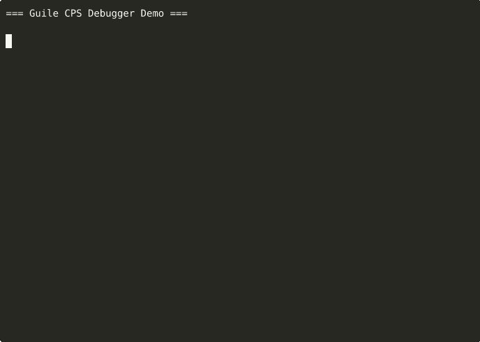

# CPS Debugger Demo

This directory contains demo recordings of the Guile CPS Debugger.

## Files

- `cps-debugger-demo.cast` - Original asciinema recording
- `cps-debugger-demo.gif` - Animated GIF version
- `cps-debugger-demo.svg` - SVG animation (if generated)

## Viewing the Demo

### Asciinema Recording
To replay the original recording with full control:
```bash
asciinema play cps-debugger-demo.cast
```

You can also upload it to asciinema.org for online viewing:
```bash
asciinema upload cps-debugger-demo.cast
```

### GIF Version
The GIF can be viewed in any web browser or image viewer. It's also suitable for embedding in documentation or README files.



## Demo Content

The demo shows:
1. Introduction to the CPS Debugger project
2. Examples of compiling Scheme code to Tree-IL
3. Project structure overview
4. Available debugger modules and features

## Recording a New Demo

To record a new demo:

1. For automated demo:
   ```bash
   asciinema rec -t "Guile CPS Debugger Demo" demo/new-demo.cast -c "./auto-demo.sh"
   ```

2. For interactive tmux demo:
   ```bash
   ./record-demo.sh
   ```

### Converting to Different Formats

#### GIF (using agg)
```bash
agg demo/cps-debugger-demo.cast demo/cps-debugger-demo.gif \
    --font-size 14 \
    --line-height 1.4 \
    --theme monokai
```

#### SVG (using svg-term-cli)
First install svg-term-cli:
```bash
npm install -g svg-term-cli
```

Then convert:
```bash
svg-term --cast=demo/cps-debugger-demo.cast --out=demo/cps-debugger-demo.svg \
    --window --width=80 --height=24 --term=xterm-256color
```

#### SVG (using termtosvg)
On FreeBSD, install with:
```bash
sudo pkg install py311-termtosvg
```

Then record directly to SVG:
```bash
termtosvg demo/cps-debugger-demo.svg -c "./auto-demo.sh"
```

Or convert existing asciicast:
```bash
termtosvg render demo/cps-debugger-demo.cast demo/cps-debugger-demo.svg
```

### Embedding in Documentation

For README files:
```markdown

```

For web pages (SVG):
```html

```